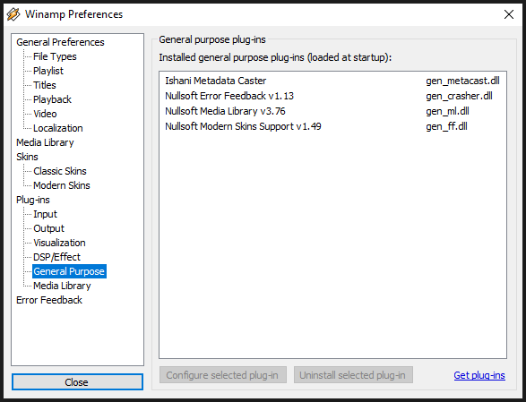
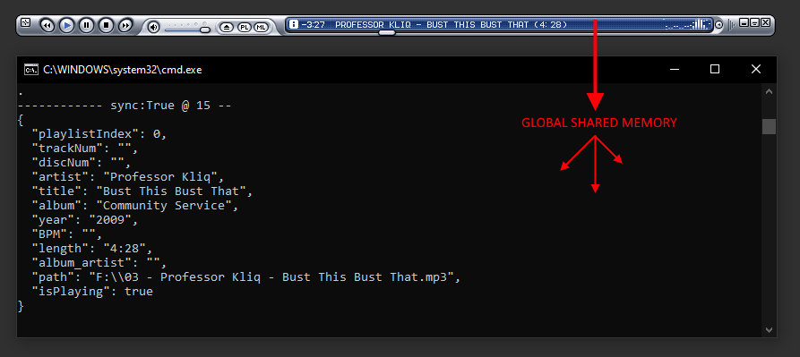
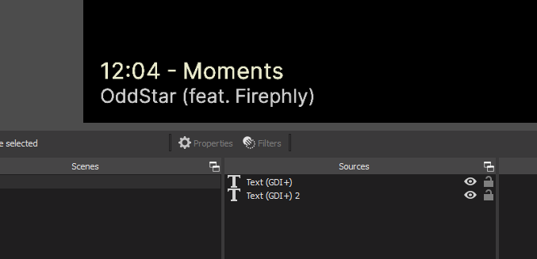

# Winamp Metacast plugin

A general purpose Winamp plugin for extracting and broadcasting the metadata for currently playing files to 3rd party apps quickly and easily.



Emits a block of JSON into a global windows memory object that can be mapped and read by anything else on the PC.



While it's barebones and not widely tested, the core code is only 300 lines and easy to hack on .. and it's been tested "in production" for many hours.

---

## Receiver example

Includes a simple C# *receiver* app that can capture & emit the metadata out to files with configurable formatting for - say - adding "**Now Playing**" labels on your streams in OBS.

A simple configuration file defines how to format metadata and where to write it, eg.

```
{
    "Configs" : 
    [
        {
            "Formatting" : "%discNum%:%trackNum% - %title%",
            "FileTarget" : "F:\\now_playing_1.txt"
        },
        {
            "Formatting" : "%artist%",
            "FileTarget" : "F:\\now_playing_2.txt"
        }
    ]
}
```



Any of the metadata entries can be used in the format string, 

 * `playlistIndex`
 * `trackNum`
 * `discNum`
 * `artist`
 * `title`
 * `album`
 * `year`
 * `BPM`
 * `length`
 * `album_artist`
 * `path`
 * `isPlaying`

